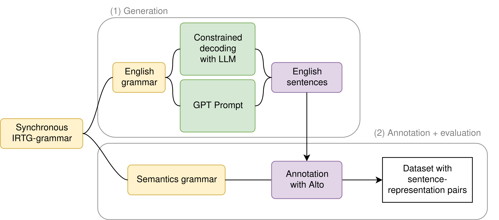

# Semantic Representation Generation

Currently, this repo aims to implement the following workflow:



The base grammars are currently in an IRTG format, which needs to be converted to EBNF for the format specifications of the Lark library. The IRTG files must first be preprocessed by the script `cogs-preprocess.py`, as parts of the files use Jinja to dynamically generate rule numbers, terminals, and probabilities.

The resulting EBNF-formatted grammar can then be used to prompt a GPT model (more information can be found in the `prompts` directory), or be used with a constrained decoding library in order to generate English sentences.

These English sentences must then be annotated in order to obtain a semantic representation for each one. To this end, the Alto tool used by SLOG should be able to use the pre-existing semantic representation grammar in order to annotate the corpus.

The result should be a corpus of English sentences paired with their semantic represenations. This workflow should be applicable both for training and test sets -- for generalization (test), the difference should be in the grammar/prompt used for the sentence generation.

## Grammars

### English sentence grammar

Add explanation of english grammar here (preprocess step, IRTG to EBNF conversion, resulting data...)

### Semantic representation grammar

In SLOG, this grammar is used synchronously with the English sentence grammar in order to produce a semantic reprensetation for each sentence.

Since this approach makes use of LLMs to generate the English sentences, we have to annotate them retrospectively as opposed to in parallel. Luckily, the Alto library allows for parsing of an unannotated corpus based on a given grammar.

For example: 

```bash
$ java -cp ../alto/build/libs/alto-2.3.8-SNAPSHOT-all.jar de.up.ling.irtg.script.ParsingEvaluator -g grammars/preprocessed-main.irtg -I english -O semantics=cogs --no-derivations test-alto.txt
```

> So far, the annotation has not yet been fully integrated with the English sentence generation steps. The above example runs on a few example sentences from the training data.
